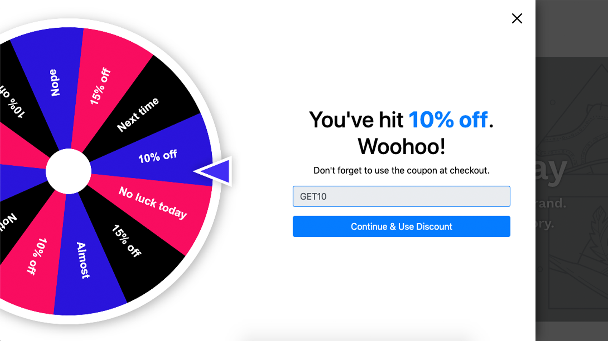
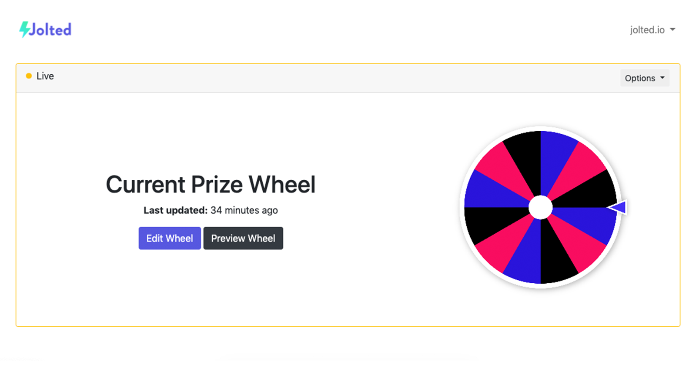

# Jolted

  

## Overview

Jolted is a Spin-the-Wheel app for Shopify stores. It adds a small pop-up to your storefront, and offers a gamified way to distribute coupon codes to your customers. After a customer "spins the wheel" they receive a discount code (via the Shopify discounts API), which they can apply to their purchase.

## Features
* Admin dashboard
* Customizable wheel segments
  * Change the probability of segment
  * Unique coupon code for each segment
* Multiple coupon types
  * Static coupon: each customer receives the same discount code e.g. `20percentoff`. This coupon never expires, and can be shared.
  * Dynamic coupon: each customer receives a unique, one-time coupon code, which expires after a specified limit (expiration can be customized for each coupon).
* Customize the color scheme of your prize wheel and pop-up
* Test mode: allows you to test the pop-up on your storefront without going live

## Screenshots

### Storefront

### Admin dashboard

## Architecture
* Ruby on Rails (server, model layer)
* React (admin dashboard, pop-up, prize wheel)
* Redis (job queue)

## Todo

* Unit tests
* Applying coupon at checkout
* Style improvements

## Test cases (for Shopify approval)

### Create a simple wheel
1. Open the Spin Wheel app
2. On home screen, click "Create Wheel."
3. On edit screen, scroll down to "Coupon Segments."
4. Fill out the "label" and "raw discount code" fields. These are arbitrary - you can use any values you'd like (e.g. random strings). The "labels" will appear on your prize wheel, and the "raw discount codes" will be awarded after spinning the wheel.
5. Scroll to the bottom and click "Save Wheel."

### Preview the wheel on your site
1. On Spin Wheel home screen, you should now see a basic thumbnail of your wheel.
2. In the middle of the home screen, click the "Preview Wheel" button. Your storefront will open in a new tab. Notice "jolted_preview=true" in the URL.
3. On the left side of the screen, click the "gift" icon. The pop-up will open.
4. In the top-left of the pop-up, it should say "Preview Mode."
5. Enter an email address (doesn't have to be a real email), and click "Try your luck."
6. After wheel is done spinning, a random prize will be awarded.
7. Click "Continue & Use Discount" to close the pop-up.

### Enable dynamic coupon codes and live mode
1. Go back to the Spin Wheel app
2. Click "Edit Wheel"
3. At the top of the edit page, turn on "Live" mode.
4. Still on the edit page, scroll down to "Discount Settings" and turn on "Use dynamic coupon codes."
5. Scroll to the bottom and click "Save Wheel."
6. Validation errors will appear.
7. Fix the errors by specifying a "coupon expiration" and "discount" for each coupon segment. For testing, these values are arbitrary.
8. Finally, scroll to the bottom and click "Save Wheel."

### Spin the wheel
1. Open new incognito window, and navigate to your storefront.
2. On the left side of the screen, click the "gift" icon. The pop-up will open.
3. Enter an email address (doesn't have to be a real email), and click "Try your luck."
4. After wheel is done spinning, a dynamic discount code will be generated using Shopify Discounts API.
5. This discount code will appear in your Shopify Admin, under "Discounts."
6. Click "Continue & Use Discount" to close the pop-up.
7. Refresh the page.
8. The pop-up can no longer be opened. It will remain hidden until the cookie expires (default is 3 days).

### Delete the wheel
1. Go back to the Spin Wheel app
2. On the home screen, in the top-right corner of the wheel thumbnail, click Options => Delete Wheel.
3. Open a new incognito window, and navigate to your storefront.
4. Ensure that the pop-up is gone.
